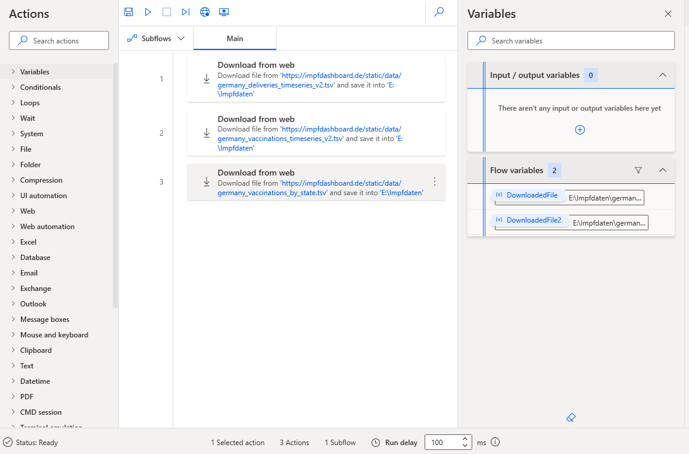
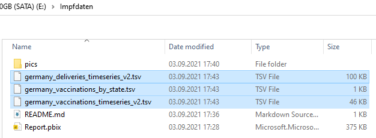
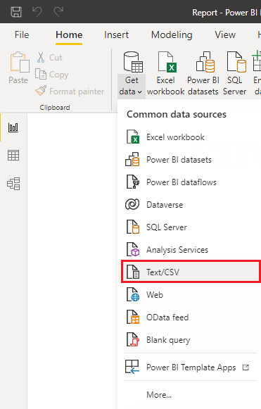
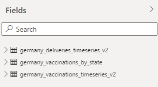
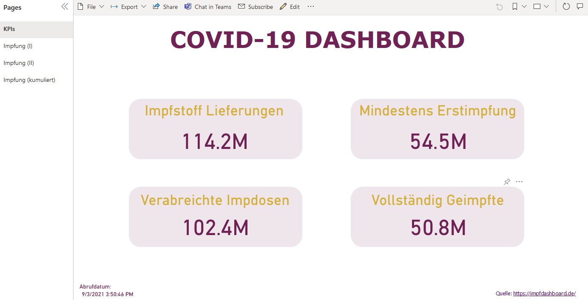
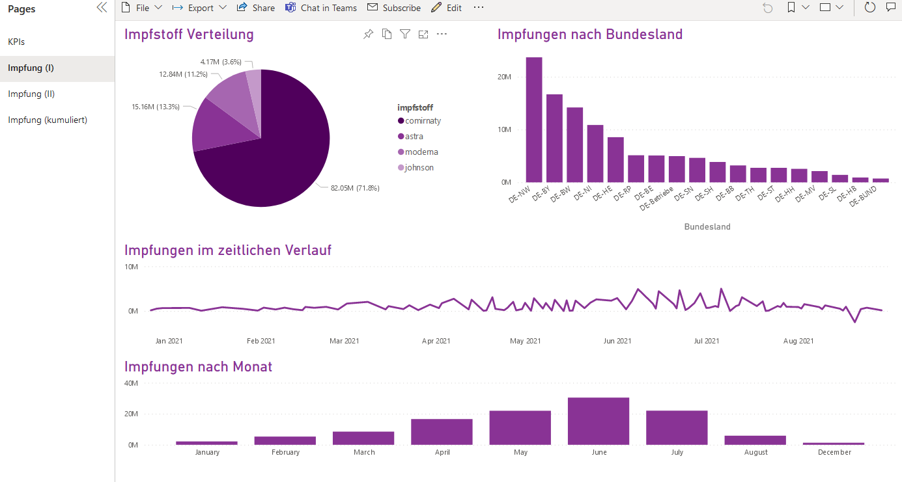
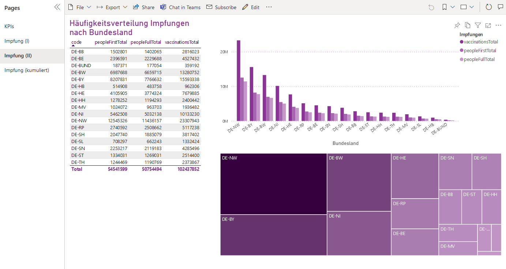
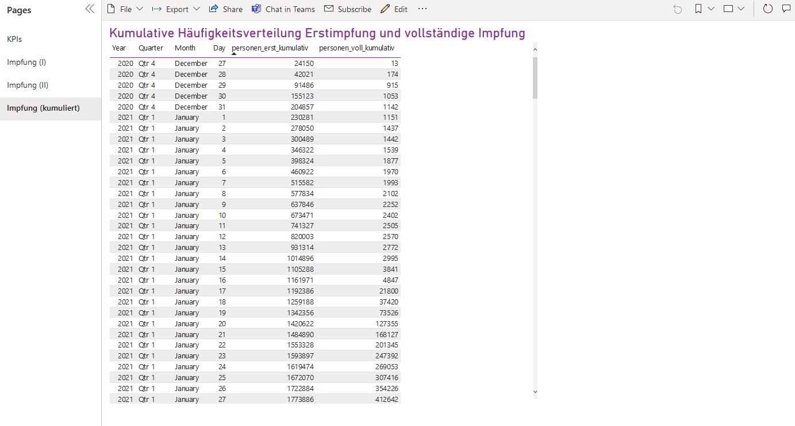

# COVID-19 DASHBOARD

Auf der Internetseite [https://impfdashboard.de/](https://impfdashboard.de/) werden zahlreiche Zahlen zu COVID-19 präsentiert. Die dahinter stehenden Datensätze werden als tab-delimited Textdateien zum Download angeboten.

Hierzu gehören die 3 Dateien:

- germany_deliveries_timeseries_v2.tsv
- germany_vaccinations_timeseries_v2.tsv
- germany_vaccinations_by_state.tsv

---

## Power Automate

Microsofts **Power Automate** ist dafür geeignet, repetitive Aufgaben zu automatisieren. Statt z.B. mit Python in Verbindung mit Selenium/BeautifulSoup die Seite mit Webscraping für die Downloads heranzuziehen, kann man das gleiche auch komfortabel und ohne Code schreiben zu müssen auch in Power Automate vollziehen.

---

Man definiert sich für die obigen drei Dateien jeweils einen **Download from web**, bei dem man die URLs der entsprechenden .TSV Datei angibt und wo diese z.B. auf dem lokalen Rechner gespeichert werden sollen. Nach erfolgreicher Ausführung werden die Dateien in das zuvor definierte Verzeichnis heruntergeladen.

## Power Bi

Um die Daten visuell aufzubereiten und übersichtlich in einem Bericht anzuzeigen, wird **Power Bi** verwendet. Zunächst müssen die drei Dateien nach Power Bi importiert werden.

---

Anschließend stehen die drei Datensätze für Auswertungen und Visualisierungen in Power Bi zur Verfügung.

---

## Finales Dashboard

Im Dashboard werden zunächst einige Kenngrößen gezeigt. In den Reitern zwei und drei des Berichts werden zu den Impfungen einige Datenvisualisierungen verwendet. Schließlich zeigt der letzte Reiter eine kumulierte Häufigkeitsverteilung zur Erstimpfung bzw. zur vollständigen Impfung. 

---

---

---

---

## Ausblick

Verfügt man über die Premium Version von Power Automate, kann man das ganze Prozedere mittels eines **Flows** auch automatisieren, sodass die Daten beispielsweise einmal täglich heruntergeladen werden.

---
